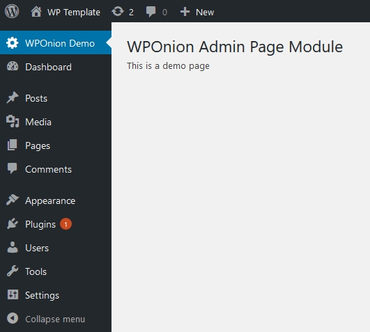

# Admin Page

## Module Arguments

<table>
  <thead>
    <tr>
      <th style="text-align:center">Key</th>
      <th style="text-align:center">Default</th>
      <th style="text-align:left">Description</th>
    </tr>
  </thead>
  <tbody>
    <tr>
      <td style="text-align:center"><b>submenu</b>
      </td>
      <td style="text-align:center">false</td>
      <td style="text-align:left">set parent menu slug to make this menu as sub menu</td>
    </tr>
    <tr>
      <td style="text-align:center"><b>menu_title</b>
      </td>
      <td style="text-align:center">false</td>
      <td style="text-align:left">The text to be used for the menu</td>
    </tr>
    <tr>
      <td style="text-align:center"><b>page_title</b>
      </td>
      <td style="text-align:center">false</td>
      <td style="text-align:left">The text to be displayed in the title tags of the page when the menu is
        selected</td>
    </tr>
    <tr>
      <td style="text-align:center"><b>capability</b>
      </td>
      <td style="text-align:center">manage_options</td>
      <td style="text-align:left">The capability required for this menu to be displayed to the user</td>
    </tr>
    <tr>
      <td style="text-align:center"><b>menu_slug</b>
      </td>
      <td style="text-align:center">if not provided the it uses <code>page_title / menu_title</code>
      </td>
      <td style="text-align:left">The slug name to refer to this menu by. Should be unique for this menu
        and only include lowercase alphanumeric, dashes, and underscores characters
        to be compatible with <a href="https://developer.wordpress.org/reference/functions/sanitize_key/">sanitize_key()</a>.</td>
    </tr>
    <tr>
      <td style="text-align:center"><b>icon</b>
      </td>
      <td style="text-align:center">false</td>
      <td style="text-align:left">value can be provided only for main menu not for submenu</td>
    </tr>
    <tr>
      <td style="text-align:center"><b>position</b>
      </td>
      <td style="text-align:center">false</td>
      <td style="text-align:left">The position in the menu order this one should appear</td>
    </tr>
    <tr>
      <td style="text-align:center"><b>on_load</b>
      </td>
      <td style="text-align:center">false</td>
      <td style="text-align:left">
        <p>provided functions / callback will be triggered when page load hook triggers</p>
        <p>uses :<b> load-{page_slug}</b>
        </p>
      </td>
    </tr>
    <tr>
      <td style="text-align:center"><b>assets</b>
      </td>
      <td style="text-align:center">false</td>
      <td style="text-align:left">use this to load selected assets only on this page if its loading.</td>
    </tr>
    <tr>
      <td style="text-align:center"><b>callback</b> / <b>render</b>
      </td>
      <td style="text-align:center">false</td>
      <td style="text-align:left">provide a custom function to call when page needs to render</td>
    </tr>
    <tr>
      <td style="text-align:center"></td>
      <td style="text-align:center"></td>
      <td style="text-align:left"></td>
    </tr>
  </tbody>
</table>### Callback Types

**`on_load`** , **`assets`** , **`callback`** / **`render`**  

all of the above mentioned arguments can handle any type of callback like \( hook  or function \)  
for more information please check the demo

## Demo

### Admin Page



### Code



```php
function wponion_render_demo_page() {
	echo 'This is a demo page';
}
wponion_admin_page( array(
	'menu_title' => __( 'WPOnion Demo' ),
	'page_title' => __( 'WPOnion Admin Page Module' ),
	'menu_slug'  => 'wponion-demo',
	'render'     => 'wponion_render_demo_page',
) );
```



### Output









## 

