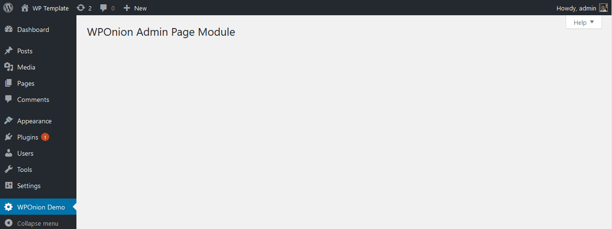

# Help Tabs

## Module Arguments <a id="module-arguments"></a>

<table>
  <thead>
    <tr>
      <th style="text-align:left">Key</th>
      <th style="text-align:left">Default</th>
      <th style="text-align:left">Description</th>
    </tr>
  </thead>
  <tbody>
    <tr>
      <td style="text-align:left"><b>page</b>
      </td>
      <td style="text-align:left">false</td>
      <td style="text-align:left">
        <p>this should contain a screen id on which page you would like to add the
          help tabs</p>
        <p>or you can also pass the instance of <b>WPOnion Admin Page</b> Module to
          auto map it.</p>
      </td>
    </tr>
    <tr>
      <td style="text-align:left"><b>tabs</b>
      </td>
      <td style="text-align:left">false</td>
      <td style="text-align:left">An array of page help tabs and its contents</td>
    </tr>
    <tr>
      <td style="text-align:left"><b>sidebar</b>
      </td>
      <td style="text-align:left">false</td>
      <td style="text-align:left">this content will be used to display in the right side of help tab in
        the screen</td>
    </tr>
  </tbody>
</table>## Core WordPress 

```php
function wponion_tab3_callback(){
	return 'Tab 3 Content Goes Here';
}

wponion_help_tabs('your-screen-id',array(
	'Tab 1' => array(
		'content' => 'Tab 1 content here ...',
	),
	'Tab 2' => array(
		'content' => 'Tab 2 content here ...',
	),
	array(
		'id' => 'tab-3',
		'title' => 'Tab 3',
		'callback' => 'wponion_tab3_callback'
	),
),'Sidebar Content Goes Here.');
```


## WPOnion Fields In Help Tabs

```php
wponion_help_tabs( 'your-page-slug', array(
	array(
		'id'     => 'tab-1',
		'title'  => 'Tab 1',
		'fields' => array(
			array( 'type' => 'heading', 'content' => 'Your Heading' ),
			array( 'type' => 'notice', 'content' => 'Notice Content Here' ),
		),
	),
	'Tab 2' => array(
		array(
			'type'            => 'accordion',
			'accordion_title' => 'Your Question 1',
			'fields'          => array(
				array( 'type' => 'content', 'content' => 'Your accordion Content Goes Here.', ),
			),
		),

		array(
			'type'            => 'accordion',
			'accordion_title' => 'Your Question 2',
			'fields'          => array(
				array( 'type' => 'content', 'content' => 'Your accordion Content Goes Here.' ),
			),
		),

		array(
			'type'            => 'accordion',
			'accordion_title' => 'Your Question 3',
			'fields'          => array(
				array( 'type' => 'content', 'content' => 'Your accordion Content Goes Here.' ),
			),
		),
	),
), '<p>Lorem Ipsum is simply dummy text of the printing and typesetting industry. Lorem Ipsum has been the industry\'s standard dummy text ever since the 1500s, </p>' );

```



